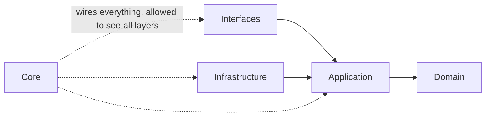

# VigilAI — Folder Structure

> Companion documents: [ARCHITECTURE.md](./ARCHITECTURE.md) · [AI_PROJECT_CONTEXT.md](./AI_PROJECT_CONTEXT.md)

This tree is the target layout the [IMPLEMENTATION_PLAN.md](./IMPLEMENTATION_PLAN.md) milestones build out incrementally — not everything exists on day one. Folders are created when the milestone that needs them starts, not preemptively.

```
vigilAI/
├── AI_PROJECT_CONTEXT.md
├── ARCHITECTURE.md
├── FOLDER_STRUCTURE.md
├── IMPLEMENTATION_PLAN.md
├── PROMPTING_GUIDE.md
├── README.md
├── TECHNICAL_DECISIONS.md
├── TASK_BACKLOG.md
├── .env.example
├── .gitignore
│
├── backend/
│   ├── pyproject.toml
│   ├── app/
│   │   ├── main.py
│   │   ├── domain/
│   │   │   ├── entities/
│   │   │   ├── value_objects/
│   │   │   ├── events/
│   │   │   └── exceptions.py
│   │   ├── application/
│   │   │   ├── ports/
│   │   │   ├── use_cases/
│   │   │   └── dto/
│   │   ├── infrastructure/
│   │   │   ├── onvif/
│   │   │   ├── streaming/
│   │   │   ├── analytics/
│   │   │   ├── persistence/
│   │   │   └── messaging/
│   │   ├── interfaces/
│   │   │   ├── api/
│   │   │   ├── websocket/
│   │   │   └── schemas/
│   │   └── core/
│   │       ├── config.py
│   │       ├── container.py
│   │       ├── logging.py
│   │       └── exception_handlers.py
│   └── tests/
│       ├── unit/
│       ├── integration/
│       └── fixtures/
│
├── frontend/
│   ├── package.json
│   └── src/
│       ├── features/
│       ├── components/
│       ├── services/
│       ├── hooks/
│       ├── store/
│       └── types/
│
├── storage/
│   ├── recordings/
│   └── models/
│
└── scripts/
```

---

## Backend — Folder by Folder

### `backend/app/domain/`
**Owns**: business entities and rules with zero framework knowledge.
**Contains**:
- `entities/` — `Camera`, `StreamProfile`, `Recording`, `DetectionEvent`, `AnalyticsZone`, `TrackedObject`.
- `value_objects/` — `Resolution`, `Codec`, `BitrateKbps`, `PlateNumber`, `ColorLabel`, `BoundingBox`.
- `events/` — domain events (`CameraWentOffline`, `LoiteringDetected`, `RecordingCompleted`).
- `exceptions.py` — domain-level exception types (`CameraUnreachableError`, `UnsupportedConfigurationError`).
**Dependencies**: none within the project. May use Python stdlib and `pydantic` (for validation-rich value objects) but never `fastapi`, `cv2`, `onvif_zeep_async`, `sqlalchemy`.
**Who touches this**: anyone adding a new business concept. Changes here should be rare and deliberate — this is the layer everything else is built to protect.

### `backend/app/application/`
**Owns**: orchestration of domain objects to fulfill a use case, and the contracts (ports) infrastructure must satisfy.
**Contains**:
- `ports/` — abstract base classes: `ICameraGateway`, `IFrameSource`, `IRecordingRepository`, `IObjectDetector`, `ILicensePlateReader`, `IEventPublisher`, `ICameraRepository`.
- `use_cases/` — one class per business operation: `OnboardCameraUseCase`, `UpdateCameraConfigUseCase`, `StartLiveStreamUseCase`, `StartRecordingUseCase`, `ListRecordingsUseCase`, `RunAnalyticsPipelineUseCase`, `ConfigureAnalyticsRuleUseCase`.
- `dto/` — plain dataclasses/Pydantic models passed between interfaces and use cases (not the same as domain entities, and not the same as API schemas — this is the use-case-facing shape).
**Dependencies**: `domain/` only.
**Who touches this**: anyone adding or changing a business operation. A new use case is the right place to start most feature work.

### `backend/app/infrastructure/`
**Owns**: every concrete integration with the outside world.
**Contains**:
- `onvif/` — `OnvifCameraGateway` (implements `ICameraGateway`) wrapping `onvif-zeep-async`: auth, `GetDeviceInformation`, `GetProfiles`, encoder config read/update, `GetStreamUri`.
- `streaming/` — `OnvifRtspFrameSource`, `RawRtspFrameSource`, `Mp4FileFrameSource` (all implement `IFrameSource`); FFmpeg process wrappers for recording and preview transcoding; the Stream Worker supervisor (reconnect/backoff logic).
- `analytics/` — detector plugins implementing `IObjectDetector`/plugin interfaces: `YoloObjectDetector`, `ColorDetector`, `LoiteringDetector`, `MissingObjectDetector`, `LicensePlateRecognizer` (composes a plate localizer + `EasyOcrReader`); the `AnalyticsOrchestrator`.
- `persistence/` — SQLModel table models, repository implementations (`SqlCameraRepository`, `SqlRecordingRepository`, `SqlEventRepository`), migrations.
- `messaging/` — in-process asyncio event bus implementing `IEventPublisher`/subscriber-side fan-out to WebSocket connections.
**Dependencies**: `application/` (to implement its ports) and `domain/` (to construct/return entities). Infrastructure modules never import each other across subfolders except through ports (e.g. `analytics/` must not import `streaming/` directly — it receives `Frame` objects, it doesn't know how they were produced).
**Who touches this**: anyone integrating a new library, protocol, or storage backend.

### `backend/app/interfaces/`
**Owns**: translation between the outside world's wire formats (HTTP, WebSocket) and use cases.
**Contains**:
- `api/` — FastAPI routers, one module per resource: `cameras.py`, `recordings.py`, `analytics.py`, `streams.py`.
- `websocket/` — connection management and message framing for live frames and live analytics events.
- `schemas/` — Pydantic request/response models (API-facing shape; converted to/from `application/dto`).
**Dependencies**: `application/` only (calls use cases; never reaches into `infrastructure/` or `domain/` directly).
**Who touches this**: anyone adding or changing an HTTP/WS endpoint.

### `backend/app/core/`
**Owns**: process-wide plumbing that doesn't belong to any single layer.
**Contains**: `config.py` (the one `Settings` class), `container.py` (composition root — builds infra adapters, injects into use cases), `logging.py` (structlog setup), `exception_handlers.py` (domain exception → HTTP status mapping).
**Dependencies**: everything (this is the wiring layer — the one place allowed to import across all other layers).
**Who touches this**: rarely, and carefully — this is the file most likely to create accidental coupling if edited casually.

### `backend/tests/`
- `unit/` — mirrors `domain/` and `application/`; uses fakes for every port, no real I/O, no real FastAPI app.
- `integration/` — exercises real infrastructure adapters against the local MP4 fixture (`tests/fixtures/sample.mp4`) and, for ONVIF, against a mock SOAP server or `@pytest.mark.hardware`-gated real camera.
- `fixtures/` — sample MP4 clips, recorded ONVIF SOAP responses for offline testing.

---

## Frontend — Folder by Folder

### `frontend/src/features/`
**Owns**: feature-scoped UI + logic, one subfolder per feature area (`camera-onboarding/`, `live-view/`, `recordings/`, `analytics-console/`). Each feature folder may contain its own components, hooks, and API-call wrappers.
**Dependencies**: `services/`, `components/`, `hooks/`, `store/`, `types/`. Features do not import from each other — shared logic moves to `components/`/`hooks`/`services` instead.

### `frontend/src/components/`
**Owns**: shared, feature-agnostic UI primitives (buttons, modals, layout shell, video player wrapper).
**Dependencies**: none within `src/` besides `types/`.

### `frontend/src/services/`
**Owns**: typed API clients (REST fetch wrappers, WebSocket connection manager). This is the only place `fetch`/`WebSocket` is called directly.
**Dependencies**: `types/`.

### `frontend/src/hooks/`
**Owns**: React Query hooks built on top of `services/` (`useCameras`, `useLiveStream`, `useRecordings`, `useAnalyticsEvents`).

### `frontend/src/store/`
**Owns**: Zustand stores for local UI state (selected camera, layout preferences, active analytics filters).

### `frontend/src/types/`
**Owns**: TypeScript types mirroring backend Pydantic schemas (kept in sync manually initially; candidate for OpenAPI-generated types later — see backlog).

---

## Top-Level Non-Code Folders

- **`storage/recordings/`** — MP4 segments written by the Recording Worker. Gitignored; the filesystem implementation of `IRecordingRepository` points here by default (configurable path).
- **`storage/models/`** — downloaded/cached model weights (YOLO `.pt` files, EasyOCR model cache). Gitignored.
- **`scripts/`** — one-off operational scripts (e.g. seed a demo camera record, download model weights, generate a sample MP4 fixture). Not part of the application; never imported by `app/`.

---

## Dependency Direction Rule (Enforced, Not Just Documented)



Plain-language version, used as the actual review checklist:

1. `domain/` imports nothing from this project.
2. `application/` imports only `domain/`.
3. `infrastructure/` and `interfaces/` import `application/` (and `domain/` for entity construction) — never each other.
4. `core/` is the only module allowed to import across all layers, because its entire job is wiring them together.
5. Frontend `features/` never import each other directly.

Milestone M0 sets up `import-linter` (or an equivalent lightweight check) to fail CI if rule 1–3 is violated, so this stays a guarantee rather than a convention that quietly rots.
