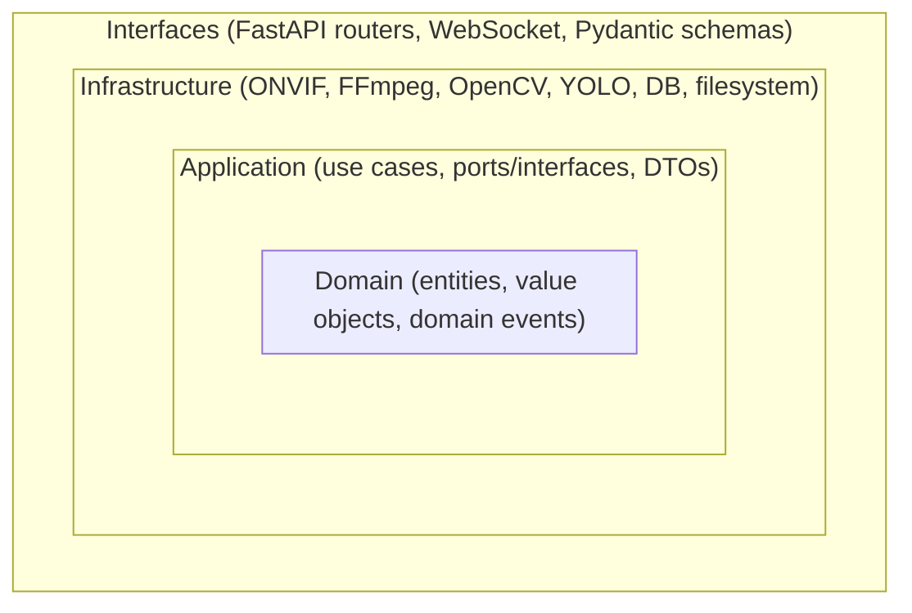
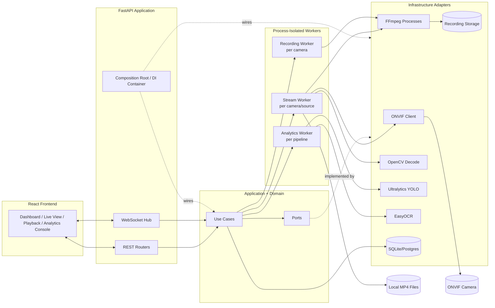
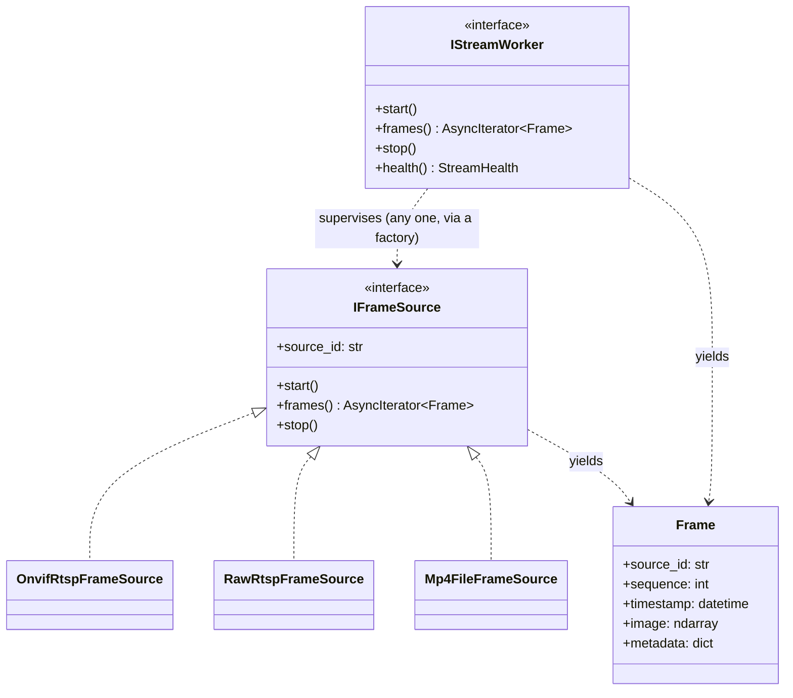
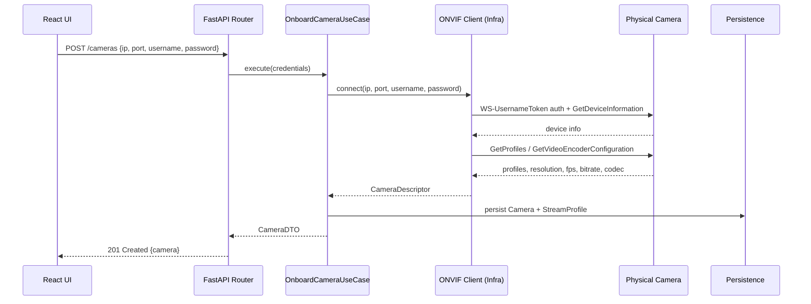
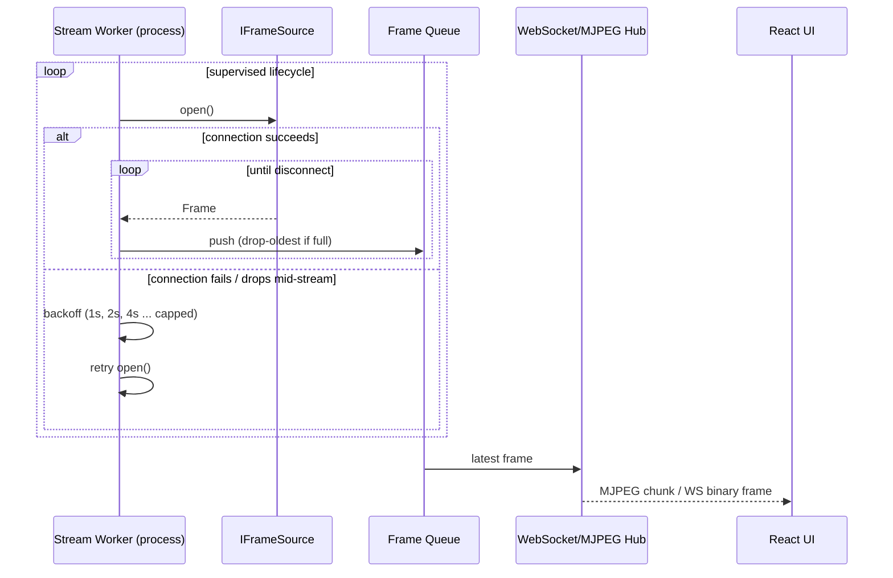
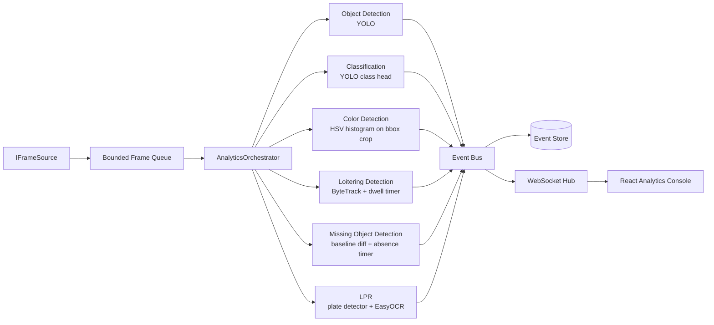

# VigilAI — Architecture

> Companion documents: [AI_PROJECT_CONTEXT.md](./AI_PROJECT_CONTEXT.md) · [FOLDER_STRUCTURE.md](./FOLDER_STRUCTURE.md) · [TECHNICAL_DECISIONS.md](./TECHNICAL_DECISIONS.md)

## 1. Goals of This Document

Explain *what* the system is made of, *why* it is shaped this way, and *how* data moves through it. This document is the architectural source of truth — the folder structure, implementation plan, and backlog are all derived from it, not the other way around.

---

## 2. Architectural Style: Clean Architecture

VigilAI is organized as concentric layers, following the Dependency Rule: **source code dependencies only point inward**. Outer layers (frameworks, I/O, hardware) depend on inner layers (business rules); inner layers know nothing about outer layers.

- **Domain** — pure Python. `Camera`, `StreamProfile`, `Recording`, `DetectionEvent`, `AnalyticsZone`. No imports from FastAPI, OpenCV, ONVIF libraries, or SQLAlchemy. Fully unit-testable with no mocks required.
- **Application** — use cases (`OnboardCameraUseCase`, `StartRecordingUseCase`, `RunAnalyticsPipelineUseCase`) and **ports**: abstract interfaces (`ICameraGateway`, `IFrameSource`, `IRecordingRepository`, `IDetectorPlugin`, `IEventPublisher`) that outer layers must implement. This is the layer that makes the rest of the system swappable.
- **Infrastructure** — concrete adapters: ONVIF client (device auth, media profiles), FFmpeg/OpenCV frame readers, Ultralytics YOLO detector, SQL repositories, filesystem recording storage. Infrastructure implements Application's ports; it never defines new business rules.
- **Interfaces** — FastAPI routers, WebSocket endpoints, Pydantic request/response schemas. Translates HTTP/WS traffic into use-case calls and use-case results back into JSON/binary frames.

**Why this matters for this project specifically:** the assignment explicitly requires that analytics not be tightly coupled to ONVIF, and that the same analytics pipeline run over ONVIF cameras, raw RTSP, and local MP4 files. Clean Architecture's port/adapter pattern is the direct mechanism for that requirement — see §5.

---

## 3. Component Map

### Component Responsibilities

| Component | Responsibility | Depends on |
|---|---|---|
| **React Frontend** | Camera onboarding UI, live view, recordings/playback, analytics dashboard, event timeline | REST + WebSocket API only |
| **FastAPI REST Routers** | HTTP surface for CRUD (cameras, recordings, analytics rules), request validation via Pydantic | Application use cases |
| **WebSocket Hub** | Push live frames (MJPEG/binary) and analytics events to subscribed clients | Application use cases, Event Bus |
| **Composition Root (DI container)** | Builds concrete adapters and injects them behind ports at startup; the *only* place concrete infra classes and abstract ports are both known | Everything (by design — it's the wiring layer) |
| **Use Cases** | Orchestrate a single business operation (e.g. "onboard a camera", "start recording") | Ports only |
| **Ports** | Abstract contracts (`IFrameSource`, `ICameraGateway`, `IDetectorPlugin`, `IRecordingRepository`, `IEventPublisher`) | Nothing (pure interfaces) |
| **Stream Worker** | Owns the lifecycle of one video source: connect, read frames, detect disconnect, reconnect with backoff, publish frames to a bounded queue | `IFrameSource` implementation |
| **Recording Worker** | Segments incoming stream to disk as MP4, writes recording metadata | FFmpeg, `IRecordingRepository` |
| **Analytics Worker** | Pulls frames from a Stream Worker's queue, runs the enabled detector plugins, emits `DetectionEvent`s | `IDetectorPlugin` implementations, Event Bus |
| **ONVIF Client** | WS-UsernameToken auth, `GetDeviceInformation`, `GetProfiles`, `GetVideoEncoderConfiguration(s)`, `SetVideoEncoderConfiguration`, `GetStreamUri` | `onvif-zeep-async`, camera network |
| **FFmpeg Processes** | RTSP ingestion, segment-based recording (stream copy), on-demand transcoding for browser preview | `ffmpeg` binary via subprocess |
| **YOLO Detector** | Object detection, classification, and (with tracking) the position data loitering detection needs | `ultralytics` |
| **EasyOCR** | Plate text extraction for LPR, after a plate-region detector crops candidates | `easyocr` |
| **Persistence** | Camera configs, recording index, detection events, analytics rules | SQLModel/SQLAlchemy |

As of M8, the Analytics Worker runs in-process (via `SupervisedFrameSource` wrapping the same `ReconnectSupervisor` reconnect/backoff loop `StreamWorker` uses, not a separate `multiprocessing.Process`) — process isolation is deferred until a real, CPU-bound detector plugin (M9+) actually needs it; see `docs/TECHNICAL_DECISIONS.md` TD-24.

---

## 4. Technology Choices (Summary)

Full reasoning and tradeoffs are in [TECHNICAL_DECISIONS.md](./TECHNICAL_DECISIONS.md). Summary:

| Concern | Choice | Why (one line) |
|---|---|---|
| API framework | FastAPI | Native async, Pydantic-first, OpenAPI docs for free, first-class WebSocket support |
| ONVIF client | `onvif-zeep-async` | Actively maintained (backs Home Assistant's ONVIF integration), async-native, wraps WS-Discovery + SOAP media/device services |
| Video ingestion | FFmpeg (subprocess) + OpenCV | FFmpeg for protocol-correct RTSP handling and zero-recode recording; OpenCV for frame-level decode when analytics need raw arrays |
| Object detection | Ultralytics YOLOv8 (+ built-in ByteTrack) | Required by assignment; ships tracking out of the box, which loitering detection needs anyway |
| OCR (LPR) | EasyOCR | PyTorch-based (no second ML runtime alongside Ultralytics), acceptable accuracy/speed on Apple Silicon (MPS) |
| Persistence | SQLModel over SQLite (dev) → Postgres (prod path) | Pydantic-native models, trivial migration story, zero ops overhead for a prototype |
| Live preview transport | MJPEG over HTTP (multipart) for MVP; WebSocket for event/metadata overlay | Simplest thing that works in every browser with no extra client library; HLS documented as a future upgrade |
| Concurrency model | One OS process per active stream (`multiprocessing`) + asyncio in the API process | OpenCV/FFmpeg I/O is blocking and CPU-bound; process isolation prevents one bad camera from stalling the API or other cameras |
| Frontend | React + TypeScript + Vite, React Query (server state) + Zustand (UI state) | Matches required stack; React Query removes hand-rolled caching/polling code |
| Config | `pydantic-settings` + `.env` | Type-checked config, single source of truth, 12-factor friendly |
| Logging | `structlog`, JSON output, correlated by `camera_id` / `trace_id` | Multi-camera, multi-process system — plain text logs are not debuggable |

---

## 5. The Core Abstraction: Unified Frame Source

This is the mechanism that satisfies the assignment's requirement that *"the downstream analytics pipeline must remain identical regardless of source."*

- `OnvifRtspFrameSource` resolves the RTSP URI via the ONVIF Media service (`GetStreamUri`) once, then delegates actual pixel decoding to the same FFmpeg/OpenCV pipeline `RawRtspFrameSource` uses. **ONVIF is only ever a configuration/control plane — it never touches pixels.**
- `RawRtspFrameSource` connects directly to a caller-supplied RTSP URL. Exists so the system works against generic RTSP streams that were never ONVIF-onboarded, and so it can be tested independently of `OnvifRtspFrameSource`.
- `Mp4FileFrameSource` reads a local file via OpenCV `VideoCapture`, optionally looping and optionally throttled to source FPS to simulate a live feed. **This is the primary development and demo path** — it lets analytics be built, tested, and demonstrated before a physical camera is available, and it's what CI runs against.
- `IStreamWorker` (M2, `docs/TECHNICAL_DECISIONS.md` TD-20) is the port a use case depends on instead of any concrete `IFrameSource` implementation directly — `health()` deliberately lives here, not on `IFrameSource`, because "connecting/reconnecting/failed" is the *supervision* state the Stream Worker adds around a source, not something a bare source (which only knows open/closed) needs to know about itself.

All three `IFrameSource` implementations emit the same `Frame` domain object. The `AnalyticsOrchestrator` (Infrastructure layer, per `docs/FOLDER_STRUCTURE.md`'s `infrastructure/analytics/` — it composes `IDetectorPlugin` implementations, so `RunAnalyticsPipelineUseCase` (Application layer) depends on it only via an injected callable, never a direct import; see `docs/TECHNICAL_DECISIONS.md` TD-24) and every detector plugin depend only on `IFrameSource`/`IDetectorPlugin` and `Frame` — they cannot import `onvif_zeep_async`, `cv2.VideoCapture`, or anything RTSP-specific. This boundary is enforced by import-linter rules described in [FOLDER_STRUCTURE.md](./FOLDER_STRUCTURE.md).

---

## 6. Key Flows

### 6.1 Camera Onboarding & Configuration

Configuration **update** (`PATCH /cameras/{id}/config`) follows the same shape, calling `SetVideoEncoderConfiguration` and only exposing fields the connected camera's ONVIF media profile reports as supported — the UI never assumes a field is writable.

### 6.2 Live Streaming + Auto-Reconnect

Reconnection is a Stream Worker responsibility, not something each `IFrameSource` implementation re-invents — the supervisor wraps *any* source in the same retry/backoff policy, so MP4 sources (which "reconnect" by re-opening/looping the file) and camera sources (which reconnect over the network) share one implementation. Concretely (M2, TD-20): `ReconnectSupervisor` is the source-agnostic open→consume→backoff→retry loop itself (no process knowledge, unit-testable against a fake flaky `IFrameSource`), and `StreamWorker` (implements the `IStreamWorker` port) runs one inside the isolated process shown above, bridging frames/health back to the API process via the two bounded, drop-oldest queues.

### 6.3 Recording & Playback

Recording reads directly from the RTSP source via an FFmpeg segment muxer (`-c copy`, no re-encode) independent of the analytics decode path, so enabling/disabling analytics never affects recording fidelity or vice versa. Segments + metadata (camera, start/end time, duration, file path, size) are written to persistence; playback is served via HTTP range requests so the browser's native `<video>` seek works without a custom protocol.

### 6.4 Analytics Pipeline

Every plugin implements `IDetectorPlugin.process(frame, context) -> list[DetectionEvent]`. The orchestrator is a plain iterator over enabled plugins per frame — there is no plugin-to-plugin coupling. `context` carries cross-frame state (track history for loitering, the baseline reference for missing-object detection) so plugins stay stateless with respect to each other while individually being allowed internal state.

---

## 7. Cross-Cutting Concerns

- **Dependency Injection**: a single composition root (`app/core/container.py`) builds every concrete adapter and hands them to use cases through constructor injection. No service-locator pattern, no global singletons reached for by import — everything a use case needs is a constructor argument, which is what makes use cases unit-testable without a running FastAPI app.
- **Configuration**: one `Settings` object (`pydantic-settings`), loaded once at startup from `.env` / environment variables, passed down through the composition root. No module reads `os.environ` directly outside `app/core/config.py`.
- **Logging**: `structlog`, JSON in production mode / console-pretty in dev mode, every log line carries `camera_id`/`source_id` and a `trace_id` where applicable, so a multi-camera, multi-process log stream can be filtered per-camera.
- **Error Handling**: domain/application layers raise typed exceptions (`CameraUnreachableError`, `UnsupportedConfigurationError`); the FastAPI exception-handler layer is the only place that translates them to HTTP status codes.
- **Testing**: domain and application layers are tested with no I/O at all (fakes implementing the ports). Infrastructure adapters are tested with real I/O against the local MP4 fixture and, where a physical camera is available, a marked `@pytest.mark.hardware` suite that's skipped in CI.

---

## 8. What This Architecture Deliberately Does Not Do Yet

Documented in full in [TECHNICAL_DECISIONS.md](./TECHNICAL_DECISIONS.md) §"Future Enhancements," but named here so scope stays honest: no distributed message broker (Redis/Kafka) yet — the in-process event bus is a port, so swapping it in later doesn't touch use cases; no object storage (S3/MinIO) for recordings yet — `IRecordingRepository`/storage is likewise a port; no auth/RBAC; no multi-node deployment; no GPU-cluster inference scaling. All of these are one-adapter-swap away, which is the point of the port boundary.
