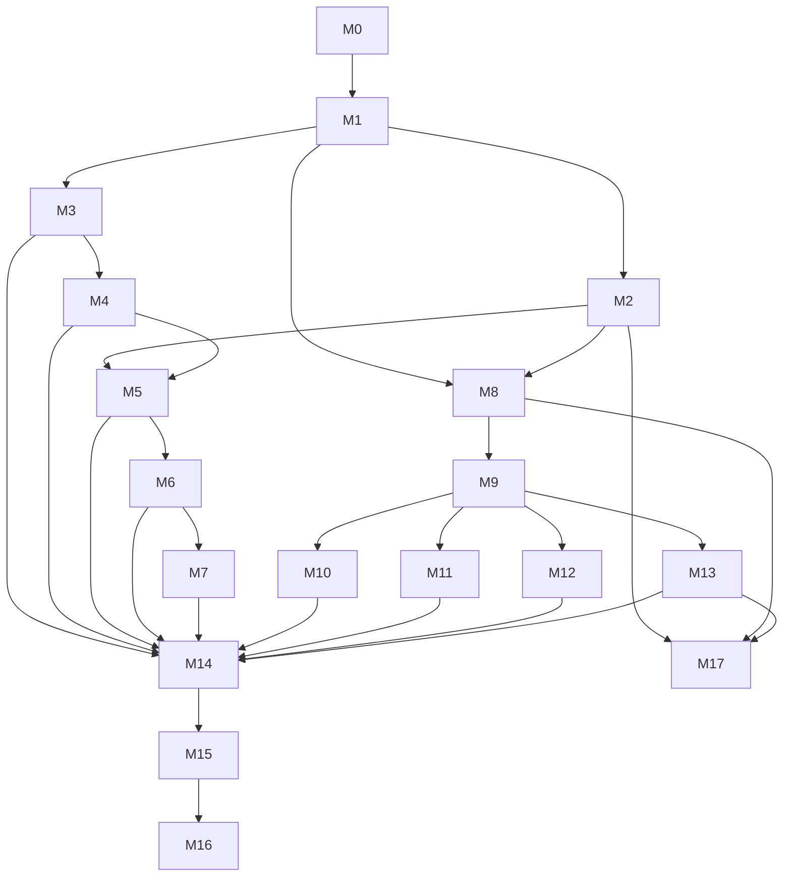

# VigilAI — Implementation Plan

> Companion documents: [ARCHITECTURE.md](./ARCHITECTURE.md) · [FOLDER_STRUCTURE.md](./FOLDER_STRUCTURE.md) · [TASK_BACKLOG.md](./TASK_BACKLOG.md)

## How to Read This Plan

Milestones are ordered by dependency, not by the order they appear in the assignment brief. Notably: **the analytics pipeline foundation (M8) is built and demoed against local MP4 files before ONVIF work starts (M3–M4)**. This is deliberate — it de-risks the parts of the project that don't depend on the evaluator's physical camera being available, and it's the most direct proof that the `IFrameSource` decoupling requirement actually holds (if analytics only ever worked with a real camera, the decoupling claim would be unverified).

Each milestone lists **Goal**, **Deliverables**, **Files** (primary ones touched/created — not exhaustive), **Acceptance Criteria** (how you know it's actually done), and **Dependencies**.

---

## M0 — Project Scaffolding & Tooling

**Goal**: A running-but-empty FastAPI + React skeleton with all quality tooling in place, so every subsequent milestone adds features instead of fighting setup.

**Deliverables**:
- Backend package structure per [FOLDER_STRUCTURE.md](./FOLDER_STRUCTURE.md) (empty `__init__.py`s establishing layers).
- `pyproject.toml` with dependencies, `ruff`/`black`/`mypy` config, `pytest` config.
- `Settings` class (`pydantic-settings`) + `.env.example`.
- `structlog` configuration.
- Composition root stub (`container.py`) — empty but wired into `main.py`.
- Import-linter (or equivalent) contract enforcing the dependency rule from FOLDER_STRUCTURE.md.
- FastAPI app boots with a `/health` endpoint.
- React + Vite + TypeScript skeleton, Tailwind configured, hits `/health` and renders the result.
- Pre-commit hooks (lint, format, type-check) or documented equivalent CI step.

**Files**: `backend/pyproject.toml`, `backend/app/main.py`, `backend/app/core/config.py`, `backend/app/core/logging.py`, `backend/app/core/container.py`, `frontend/package.json`, `frontend/src/App.tsx`, `.env.example`, `.gitignore`.

**Acceptance Criteria**:
- `uvicorn app.main:app` starts cleanly; `GET /health` returns `200`.
- `npm run dev` serves a page that displays the backend health status.
- `ruff`/`mypy`/`pytest` all run and pass (pytest with zero tests is fine — it must at least run).
- Import-linter contract fails intentionally if a test import violates layering, then is reverted (proves the gate works).

**Dependencies**: none.

---

## M1 — Domain & Application Core

**Goal**: The business vocabulary of the system exists as code, independent of any framework or I/O, with the ports every future adapter will implement.

**Deliverables**:
- Domain entities: `Camera`, `StreamProfile`, `Recording`, `DetectionEvent`, `AnalyticsZone`, `TrackedObject`.
- Value objects: `Resolution`, `Codec`, `BitrateKbps`, `BoundingBox`, `ColorLabel`, `PlateNumber`.
- Domain exceptions.
- Ports: `ICameraGateway`, `IFrameSource`, `ICameraRepository`, `IRecordingRepository`, `IObjectDetector`, `ILicensePlateReader`, `IEventPublisher`.
- Use case skeletons (signatures + docstring-level intent, real logic filled in per later milestone): `OnboardCameraUseCase`, `UpdateCameraConfigUseCase`, `StartLiveStreamUseCase`, `StartRecordingUseCase`, `ListRecordingsUseCase`, `RunAnalyticsPipelineUseCase`.
- Unit tests for every domain entity/value object's validation rules.

**Files**: `backend/app/domain/**`, `backend/app/application/ports/**`, `backend/app/application/use_cases/**`, `backend/tests/unit/domain/**`.

**Acceptance Criteria**:
- 100% of domain/value-object code covered by unit tests that require zero mocking (pure functions/objects).
- No file under `domain/` or `application/` imports `fastapi`, `cv2`, `onvif_zeep_async`, `sqlalchemy`, or anything from `infrastructure/`/`interfaces/` — enforced by the M0 import-linter gate.

**Dependencies**: M0.

---

## M2 — Frame Source Abstraction + MP4 File Adapter

**Goal**: Prove the `IFrameSource` abstraction with the adapter that has zero external dependencies — local MP4 playback — before touching cameras or ONVIF at all.

**Deliverables**:
- `Frame` domain object finalized (image array, timestamp, sequence, source_id, metadata).
- `Mp4FileFrameSource` (OpenCV `VideoCapture`-based), with looping and FPS-throttling options.
- Stream Worker: process-isolated frame-grab loop, bounded drop-oldest queue, health reporting.
- A minimal FastAPI endpoint to start a local-file "stream" and confirm frames are flowing (via a debug endpoint or log output — full live-view UI comes in M5).
- Integration tests using a committed sample MP4 fixture.

**Files**: `backend/app/domain/entities/frame.py`, `backend/app/infrastructure/streaming/mp4_frame_source.py`, `backend/app/infrastructure/streaming/reconnect_supervisor.py`, `backend/app/infrastructure/streaming/stream_worker.py`, `backend/app/application/ports/stream_worker.py` (new `IStreamWorker` port), `backend/tests/fixtures/sample.mp4`, `backend/tests/integration/streaming/**`. See `docs/TECHNICAL_DECISIONS.md` TD-20 for why the reconnect loop and the process-isolation wrapper are two separate classes, and for a known limitation of the committed fixture.

**Acceptance Criteria**:
- Given the fixture MP4, the Stream Worker produces `Frame`s at the expected rate in a separate process, observable via a debug endpoint.
- Killing/stalling the source and restarting it is handled by the same reconnect/backoff code path that camera sources will later use (verified by unit test with a fake flaky `IFrameSource`).

**Dependencies**: M1.

---

## M3 — ONVIF Camera Onboarding

**Goal**: Authenticate against a real (or ONVIF-simulator) camera using IP + username + password and read its identity/profile info.

**Deliverables**:
- `OnvifCameraGateway` implementing `ICameraGateway` via `onvif-zeep-async`: connect, `GetDeviceInformation`, `GetProfiles`.
- `OnboardCameraUseCase` fully implemented, persisting the camera + discovered profiles.
- `POST /cameras` endpoint + Pydantic request/response schemas.
- Basic frontend "Add Camera" form.
- Clear, typed error surfaces for unreachable host, auth failure, and unsupported ONVIF version.

**Files**: `backend/app/infrastructure/onvif/**`, `backend/app/interfaces/api/cameras.py`, `backend/app/interfaces/schemas/camera.py`, `frontend/src/features/camera-onboarding/**`. Also, not obvious from the deliverables above but required to actually satisfy this milestone's acceptance criteria (see TD-18): `backend/app/infrastructure/persistence/**` (`SqlCameraRepository` — AC #3, "persisted... survives an API restart," has no adapter without it), `backend/app/infrastructure/security/credential_cipher.py` (TD-15's encryption requirement), `backend/app/core/exception_handlers.py` (the typed-exception-to-HTTP-status mapping the Constraints section requires), and the `backend/app/core/container.py`/`backend/app/main.py` wiring for all of it.

**Acceptance Criteria**:
- Against the evaluator's physical camera (or, until it's available, an ONVIF camera simulator / recorded SOAP fixtures), `POST /cameras` with valid IP/username/password returns `201` with device info and at least one media profile.
- Invalid credentials return a clear `4xx` with a typed error, not a stack trace.
- Onboarding is persisted and survives an API restart (`GET /cameras` lists it).

**Dependencies**: M1. (Independent of M2 — can be built in parallel if needed.)

---

## M4 — ONVIF Configuration Read & Update

**Goal**: Read and, where the camera supports it, update resolution/FPS/bitrate/codec.

**Deliverables**:
- Extend `OnvifCameraGateway` with `GetVideoEncoderConfiguration(s)` and `SetVideoEncoderConfiguration`.
- `UpdateCameraConfigUseCase`, only exposing fields the camera's own profile reports as configurable.
- `GET /cameras/{id}/config`, `PATCH /cameras/{id}/config` endpoints.
- Frontend camera config panel showing current values and an edit form limited to supported fields.

**Files**: `backend/app/infrastructure/onvif/encoder_config.py`, `backend/app/application/use_cases/update_camera_config.py`, `backend/app/interfaces/api/cameras.py`, `frontend/src/features/camera-onboarding/ConfigPanel.tsx`.

**Acceptance Criteria**:
- `GET /cameras/{id}/config` returns resolution, FPS, bitrate, and codec sourced live from the camera (not cached stale data, unless explicitly requested via a query param).
- `PATCH` with a supported change is reflected on a subsequent `GET`.
- `PATCH` with an unsupported field/value returns a typed `4xx`, never silently ignored.

**Dependencies**: M3.

---

## M5 — Live Streaming + Auto-Reconnect

**Goal**: View a camera's live stream in the browser, with automatic recovery from disconnects.

**Deliverables**:
- `OnvifRtspFrameSource` and `RawRtspFrameSource` implementing `IFrameSource`, sharing the FFmpeg/OpenCV decode path.
- `StartLiveStreamUseCase` wiring a Stream Worker to a real RTSP source resolved via `GetStreamUri`.
- MJPEG-over-HTTP live-view endpoint; WebSocket channel for stream health/status.
- Reconnect/backoff verified against real network interruption (unplug/replug or simulated by killing the RTSP source).
- Frontend live-view component (``-based MJPEG viewer) with connection-status indicator.

**Files**: `backend/app/infrastructure/streaming/rtsp_frame_source.py`, `backend/app/interfaces/api/streams.py`, `backend/app/interfaces/websocket/stream_status.py`, `frontend/src/components/LiveView.tsx` (moved here from `features/live-view/` post-M14 once the Dashboard needed it too — see `docs/FOLDER_STRUCTURE.md`).

**Acceptance Criteria**:
- Live view renders in-browser for the physical camera (or an RTSP test stream) within a few seconds of starting.
- Simulated disconnect (e.g. camera network cable pulled, or test RTSP server killed) results in automatic reconnection without manual intervention, visible in logs and reflected in the UI's connection-status indicator.
- Analytics-independent: turning analytics on/off (once it exists, M8+) does not change live-view behavior.

**Dependencies**: M2 (shared decode path), M3/M4 (for `GetStreamUri`).

---

## M6 — Recording

**Goal**: Record a camera's stream to disk as MP4 segments with metadata.

**Deliverables**:
- Recording Worker: FFmpeg segment muxer (`-c copy`) reading directly from the RTSP source, independent of the analytics decode path.
- `StartRecordingUseCase` / `StopRecordingUseCase`.
- `SqlRecordingRepository` persisting segment metadata (camera, start/end time, duration, file path, size).
- `POST /cameras/{id}/recording/start`, `/stop`, `GET /recordings` endpoints.
- Frontend recording control (start/stop) with visible status.

**Files**: `backend/app/infrastructure/streaming/recording_worker.py`, `backend/app/infrastructure/persistence/recording_repository.py`, `backend/app/application/use_cases/start_recording.py`, `backend/app/interfaces/api/recordings.py`.

**Acceptance Criteria**:
- Starting a recording produces valid, playable MP4 segment(s) on disk under `storage/recordings/`.
- Recording metadata is queryable via `GET /recordings` immediately after stopping.
- Recording continues correctly across the live-view MJPEG stream being opened/closed (the two paths don't interfere).

**Dependencies**: M5.

---

## M7 — Playback

**Goal**: Browse and play back recorded footage from the frontend.

**Deliverables**:
- Playback endpoint serving MP4 via HTTP range requests (seekable).
- `ListRecordingsUseCase` with camera/date filtering.
- Frontend recordings list + native `<video>` player with seek.

**Files**: `backend/app/interfaces/api/recordings.py` (extended), `frontend/src/features/recordings/**`.

**Acceptance Criteria**:
- A recorded segment plays back in-browser with working seek/scrub, confirming range-request support.
- Recordings list is filterable by camera and time range.

**Dependencies**: M6.

---

## M8 — Analytics Pipeline Foundation

**Goal**: Build the plugin orchestrator and event infrastructure, proven against the MP4 file source (M2) — no detector logic yet, just the pipeline shape and the identical-across-sources guarantee.

**Deliverables**:
- `IDetectorPlugin` interface, `AnalyticsOrchestrator` iterating enabled plugins per frame.
- `DetectionEvent` persistence + in-process event bus (`IEventPublisher` implementation) + WebSocket fan-out.
- A trivial "no-op"/passthrough plugin used purely to prove the orchestrator wiring end-to-end.
- Analytics enable/disable per camera/source via API.
- Proof test: same orchestrator + same plugin, run once against `Mp4FileFrameSource` and once against a fake `IFrameSource` double, asserting identical plugin invocation behavior.

**Files**: `backend/app/application/use_cases/run_analytics_pipeline.py`, `backend/app/infrastructure/analytics/orchestrator.py`, `backend/app/infrastructure/messaging/event_bus.py`, `backend/app/interfaces/websocket/analytics_events.py`.

**Acceptance Criteria**:
- Analytics can be toggled on for the MP4 demo source and events (even from the no-op plugin) appear over WebSocket and in the event table.
- The source-independence test from the deliverables passes and is kept permanently in the suite as a regression guard for the assignment's core architectural requirement.

**Dependencies**: M1, M2. (Explicitly does not depend on M3–M7 — this is the point.)

---

## M9 — Object Detection & Classification

**Goal**: Real detection using Ultralytics YOLO.

**Deliverables**:
- `YoloObjectDetector` implementing the detector plugin interface — detection + classification come from the same YOLO inference call.
- Model weight download/caching into `storage/models/`.
- Bounding boxes + class labels attached to `DetectionEvent`s.
- Frontend overlay rendering boxes/labels on the live view and on recorded playback (if timestamps align with stored events).

**Files**: `backend/app/infrastructure/analytics/yolo_detector.py`, `frontend/src/features/analytics-console/DetectionOverlay.tsx`.

**Acceptance Criteria**:
- Running against the MP4 demo fixture produces correct-looking bounding boxes/classes for visible objects (spot-checked manually).
- Runs against the physical camera's live stream at an acceptable frame rate on the Mac Mini (document the achieved FPS — this is a legitimate prototype-stage finding, not a hidden failure).

**Dependencies**: M8.

---

## M10 — Color Detection

**Goal**: Extract a dominant color label for detected objects.

**Deliverables**:
- `ColorDetector` plugin: crops each detected bounding box, computes dominant color via HSV histogram/k-means, maps to a human-readable label (e.g. "red", "blue", "black").
- Color label attached to relevant `DetectionEvent`s and surfaced in the UI.

**Files**: `backend/app/infrastructure/analytics/color_detector.py`.

**Acceptance Criteria**:
- For a small manually-curated set of test crops with known colors, the detector's label matches expectation in a unit test.
- Color labels appear alongside object detections in the live analytics console.

**Dependencies**: M9 (consumes its bounding boxes).

---

## M11 — Loitering Detection

**Goal**: Flag objects/people that remain in a zone beyond a configurable duration.

**Deliverables**:
- Enable YOLO tracking (`model.track()` / ByteTrack) to get persistent object IDs across frames.
- `AnalyticsZone` definition (polygon) configurable per camera via API + a simple frontend zone editor (draw on a still frame).
- `LoiteringDetector` plugin: maintains per-track dwell time within a zone, emits an event once the threshold is crossed (and doesn't spam duplicate events every frame after).

**Files**: `backend/app/infrastructure/analytics/loitering_detector.py`, `backend/app/domain/entities/analytics_zone.py`, `frontend/src/features/analytics-console/ZoneEditor.tsx`.

**Acceptance Criteria**:
- Against the MP4 fixture (or live camera) with a defined zone and a low test threshold (e.g. 5s), a loitering event fires once per qualifying dwell period, not once per frame.
- Threshold and zone are configurable without a code change.

**Dependencies**: M9.

---

## M12 — Missing Object Detection

**Goal**: Flag when an object present in a reference/baseline view disappears for longer than a threshold.

**Deliverables**:
- Baseline capture mechanism (snapshot a reference frame/region, or a reference detection set for a defined zone).
- `MissingObjectDetector` plugin: on each frame, compares current detections/region state in the zone against baseline; starts an absence timer when a previously-present object is no longer detected; emits an event past threshold.

**Files**: `backend/app/infrastructure/analytics/missing_object_detector.py`.

**Acceptance Criteria**:
- Demonstrable against a prepared MP4 clip: object present at baseline capture, later removed from frame, event fires after the configured threshold and not before.
- False-positive guard: brief occlusion (a person walking in front of the object for under the threshold) does not fire an event — verified with a crafted test clip or unit test using synthetic detection sequences.

**Dependencies**: M9.

---

## M13 — License Plate Recognition (OCR)

**Goal**: Detect and read license plates.

**Deliverables**:
- Plate region localization (YOLO-based plate detector if a suitable pretrained/fine-tuned model is available in time; otherwise a documented classical-CV fallback, e.g. contour/edge-based candidate region extraction).
- `EasyOcrReader` implementing `ILicensePlateReader`, run only on localized plate crops.
- `LicensePlateRecognizer` plugin composing the two, emitting `DetectionEvent`s with recognized plate text + confidence.

**Files**: `backend/app/infrastructure/analytics/plate_localizer.py`, `backend/app/infrastructure/analytics/easyocr_reader.py`, `backend/app/infrastructure/analytics/license_plate_recognizer.py`.

**Acceptance Criteria**:
- Against an MP4 clip containing a clearly visible plate, recognized text matches the actual plate in at least a majority of sampled frames (document actual accuracy honestly — this is the highest-difficulty, highest-variance analytic in the set).
- Plugin never blocks the orchestrator loop for other plugins — OCR latency is isolated (documented approach: async/queued execution rather than inline per-frame blocking if inference time requires it).

**Dependencies**: M9 (shares detection infra patterns, though plate detection is a separate model).

---

## M14 — Frontend Dashboard Integration

**Goal**: Tie every backend capability together into one coherent, navigable UI.

**Deliverables**:
- Camera management view (list, onboard, configure).
- Live view with analytics overlay toggle.
- Recordings/playback view.
- Analytics event timeline/console (filterable by camera, event type, time range).
- Zone editor accessible from the relevant camera.

**Files**: `frontend/src/features/**` (integration pass across all feature folders), `frontend/src/App.tsx` routing.

**Acceptance Criteria**:
- A user can, without touching the API directly, onboard the physical camera, view its live stream, configure it, start/stop recording, play back a recording, enable analytics, define a zone, and see live events — start to finish through the UI.

**Dependencies**: M3–M13.

---

## M15 — Testing, Hardening, Documentation Polish

**Goal**: Bring test coverage, error handling, and docs to the bar implied by "production-quality prototype."

**Deliverables**:
- Unit test coverage audit for domain/application layers; integration coverage audit for infrastructure adapters.
- Error-path review: every use case's failure modes produce typed exceptions and correct HTTP status codes.
- Structured logging audit — every worker process logs enough to debug a field issue without a debugger attached.
- Update `AI_PROJECT_CONTEXT.md` "Project State" section, `README.md` with real setup commands (replacing placeholders), and any TECHNICAL_DECISIONS.md entries that changed during implementation.

**Files**: cross-cutting; `README.md`, `AI_PROJECT_CONTEXT.md`.

**Acceptance Criteria**:
- Full test suite passes; coverage report reviewed for meaningful gaps (not just percentage).
- README's setup instructions work when followed literally on a clean checkout.

**Dependencies**: M0–M14 substantially complete.

---

## M16 — Dockerization (Stretch, Time-Permitting)

**Goal**: Containerize backend + frontend for reproducible setup, only after everything above is solid.

**Deliverables**:
- `Dockerfile` for backend (with FFmpeg installed), `Dockerfile` for frontend, `docker-compose.yml` wiring both plus a volume for `storage/`.
- Documented device/network access approach for reaching the physical camera and, if needed, host webcam/USB devices from the container.

**Files**: `backend/Dockerfile`, `frontend/Dockerfile`, `docker-compose.yml`.

**Acceptance Criteria**:
- `docker compose up` brings up a working system reachable at documented ports, camera onboarding works from within the container against the LAN camera.

**Dependencies**: M15. Explicitly last — per the assignment brief, do not let this displace core feature time.

---

## M17 — Demo Video Library

**Goal**: Let an operator demo an analytics capability (starting with License Plate Recognition) against a pre-recorded clip, with no camera or network dependency — promoted from `TASKS.md`'s "Demo Preparation" placeholder per its own note ("promote it to an M17 entry ... don't let scope accumulate silently").

**Deliverables**:
- `IDemoVideoRepository` port + `LocalDemoVideoRepository` adapter: scans a configured directory (`storage/demo_videos/`, gitignored) for video files and resolves a filesystem-safe slug id back to a file path, never joining caller input onto a path (traversal-safe by construction, not by denylist).
- `StartDemoStreamUseCase` + `/demo/videos` router: list/start/stop/status/MJPEG-stream one entry, keyed by the slug `video_id: str` — the same MJPEG-over-HTTP shape `/streams` already proves for cameras (T-052), reusing `StreamWorker`/`Mp4FileFrameSource` unchanged.
- A third branch in `Container._build_analytics_frame_source`, checked before the camera-UUID fallback: a demo video's `source_id` resolves to a `Mp4FileFrameSource` over its file, then flows through the existing analytics pipeline identically to the `"mp4-demo"` fixture and real cameras — no detector plugin changes.
- Frontend: a dedicated `/demo` page listing available clips with a Play button; playing one composes the existing `AnalyticsToggle` (already source-agnostic) and a generalized `DetectionOverlay` (fixed to filter on `metadata.source_id` rather than a camera UUID, and extended to render `license_plate_recognition.*` boxes — previously rendered by nothing at all, for any source).

**Files**: `backend/app/domain/entities/demo_video.py`, `backend/app/application/ports/demo_video_repository.py`, `backend/app/infrastructure/streaming/local_demo_video_repository.py`, `backend/app/application/use_cases/{list_demo_videos,start_demo_stream}.py`, `backend/app/interfaces/api/demo_videos.py`, `backend/app/interfaces/websocket/demo_stream_status.py`, `backend/app/core/container.py`, `frontend/src/pages/DemoPage.tsx`, `frontend/src/features/demo/DemoVideoPlayer.tsx`, `frontend/src/features/analytics-console/DetectionOverlay.tsx`.

**Acceptance Criteria**:
- Dropping a video file into `storage/demo_videos/` makes it appear in `GET /demo/videos` with no restart or registration step.
- Enabling analytics on a demo video's id emits real `DetectionEvent`s (proven directly for `license_plate_recognition.*` in `tests/integration/analytics/test_demo_video_lpr_integration.py`) — the same pipeline guarantee T-086 already protects, exercised over a third kind of source.
- `/demo` page: pick a clip, press Play, toggle Analytics, see bounding boxes (including LPR plate text) over the video — no camera onboarded, no network video source.

**Explicitly out of scope**: fetching video from YouTube or any other external/network source (considered and rejected — a `<iframe>` embed can't expose frames to the backend for real CV processing, and this repo already declines to fetch arbitrary external content unprompted, TD-20's precedent); LPR accuracy tuning against real-world footage (TD-30's fixture-only accuracy claim stands unchanged — real clips may read poorly, documented as a caveat, not silently implied to work).

**Dependencies**: M2 (`Mp4FileFrameSource`), M8 (analytics pipeline foundation), M13 (the LPR plugin being demoed).

---

## Addendum: Camera & Event Lifecycle Management (post-M14)

Not a numbered milestone — real gaps surfaced by using M14's shipped UI (no way to edit/delete a camera, no cascading cleanup of its recordings, no way to clear analytics events, no visibility into per-camera analytics on/off state beyond an approximate dashboard count) rather than planned up front. See `docs/TASK_BACKLOG.md`'s "Camera & Event Lifecycle Management" epic (T-170–T-176) and `docs/TECHNICAL_DECISIONS.md` TD-32 for the cascade-delete design.

---

## Addendum: RTMP Push/Consume Demo

Not a numbered milestone, and not part of the assignment's graded scope (confirmed against `docs/AI_PROJECT_CONTEXT.md`'s required-scope list) — a standalone demo page proving `Video File → ffmpeg RTMP Publisher → MediaMTX RTMP Server → RTMP Consumer → Player`, requested directly since the project has no physical RTMP camera. Isolated deliberately: its own backend package (`infrastructure/rtmp_demo/`), its own `/rtmp-demo` API prefix, and its own frontend feature folder/route, reusing the existing `IFrameSource`/`StreamWorker`/`ReconnectSupervisor` machinery and the M17 demo video library rather than duplicating either. See `docs/RTMP_DEMO.md` for the architecture, terminology, local test flow, and failure-scenario coverage, and `docs/TECHNICAL_DECISIONS.md` TD-33 for the MediaMTX choice, subprocess lifecycle, auth model, and an observed FFmpeg/OpenCV RTMP interop caveat.

---

## Milestone Dependency Graph

