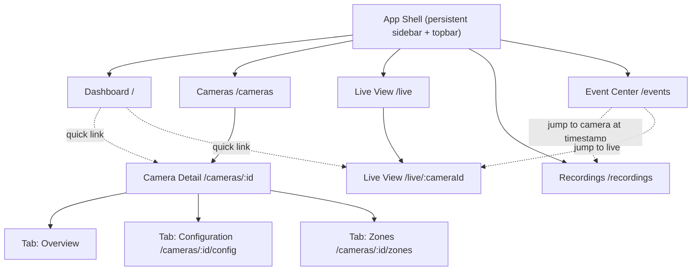

# UI/UX Design — M14 Frontend Dashboard Integration

> Companion documents: [IMPLEMENTATION_PLAN.md](./IMPLEMENTATION_PLAN.md) §M14 · [TASK_BACKLOG.md](./TASK_BACKLOG.md) Epic M14 · [FOLDER_STRUCTURE.md](./FOLDER_STRUCTURE.md) "Frontend — Folder by Folder" · [TECHNICAL_DECISIONS.md](./TECHNICAL_DECISIONS.md) TD-12

## 0. How This Document Was Built

Before drafting anything, the existing backend API surface and existing frontend code were read in full: every router under `backend/app/interfaces/api/`, every schema under `backend/app/interfaces/schemas/`, both WebSocket channels, and every existing file under `frontend/src/` (`App.tsx`, all `features/`, `hooks/`, `services/`, `types/`). This document **only** designs screens and flows that a real, already-implemented backend endpoint can satisfy. Where a natural VMS feature (delete a camera, delete a recording, bulk actions, global settings) has **no** backing endpoint today, that is called out explicitly in §11 as deferred/out of scope rather than quietly designed around — per `AGENTS.md`'s "do not invent backend functionality."

This document went through the Phase 2 review pass described in the driving prompt; see §13 for what the review changed.

---

## 1. Product Framing (recap, not a re-derivation)

VigilAI is a single-operator VMS prototype (`docs/AI_PROJECT_CONTEXT.md` §7 Non-Goals: no auth/RBAC, no multi-tenant). One person, one browser tab, a handful of cameras. The UI does not need role-based views, multi-user presence, or org-switching — it needs one coherent, fast path from "here's a camera's IP" to "here's what my analytics saw." That framing drives every layout decision below: a persistent nav shell, no login wall, no per-user preferences.

---

## 2. Navigation Hierarchy

Five top-level destinations in the sidebar, always visible, no login gate. `Cameras` is the only branch with sub-navigation (tabs on a detail page) — matches M14's explicit instruction that "Zone editor [is] accessible from the relevant camera," not a standalone top-level screen.

---

## 3. Sitemap (route table)

| Route | Screen | New/Existing UI |
|---|---|---|
| `/` | Dashboard | New |
| `/cameras` | Camera List (+ Add Camera dialog) | Existing components (`AddCameraForm`, `CameraList`), new page wrapper + routing |
| `/cameras/:cameraId` | Camera Detail → Overview tab | New page composing existing pieces |
| `/cameras/:cameraId/config` | Camera Detail → Configuration tab | Existing `ConfigPanel`, relocated from inline expansion to a tab |
| `/cameras/:cameraId/zones` | Camera Detail → Zones tab | Existing `ZoneEditor`, relocated from a global section to a tab |
| `/live` | Live View hub (camera picker, redirects to last-viewed or first camera) | New |
| `/live/:cameraId` | Live View for one camera | Existing `LiveView` + `DetectionOverlay` + `RecordingControl`, composed on a routed page |
| `/recordings` | Recordings Browser (optionally pre-filtered via `?camera=&start=&end=`) | Existing `RecordingsBrowser`, relocated to its own route, extended to read query-string presets |
| `/events` | Event Center | New page; new `services/`/`hooks/` for `GET /analytics/events` (not yet wrapped on the frontend) |

Not a route: a global "Settings" page — see §10.7.

---

## 4. Screen Inventory

| # | Screen | Purpose | Depends on (milestone) |
|---|---|---|---|
| 1 | Dashboard | At-a-glance system state; entry point | M3–M13 (reads across all of them) |
| 2 | Camera List | Onboard + browse cameras | M3 |
| 3 | Camera Detail — Overview | One camera's identity/profile summary + shortcuts | M3 |
| 4 | Camera Detail — Configuration | Read/edit resolution/FPS/bitrate | M4 |
| 5 | Camera Detail — Zones | Draw/edit/delete loitering + missing-object zones | M11, M12 |
| 6 | Live View | Watch a camera, toggle analytics overlay, start/stop recording | M5, M9, M10, M6 |
| 7 | Recordings Browser | Filter, browse, and play back recordings | M6, M7 |
| 8 | Event Center | Live + historical analytics event feed, filterable | M8–M13 |

Every screen below is detailed with **Purpose / Widgets / Actions / Backend APIs used / Milestones it depends on**, per the brief's requirement.

---

## 5. Global UI Conventions (apply across screens)

### 5.1 Layout shell
Persistent left sidebar (collapses to a top bar + hamburger under `sm`, per T-142's responsive pass) with the 5 nav items from §2, active-route highlighting, and a topbar showing the app name and a lightweight connectivity indicator (derived client-side from whether the last API call succeeded — no new backend health-aggregation endpoint invented; `GET /health` already exists and is polled at a low frequency for this).

### 5.2 Tables
Used on: Camera List, Recordings Browser, Event Center. Convention: sticky header row, zebra-free (matches existing Tailwind slate palette already in use), a status/type indicator as a leading dot or badge (existing pattern from `CameraList`'s online dot and `LiveView`'s state dot), row click opens detail where a detail view exists (camera row → Camera Detail; recording row → inline player, already the existing `RecordingsBrowser` behavior; event row → expandable detail, since events have no dedicated detail route).

### 5.3 Forms
Convention already established by `AddCameraForm`/`ConfigPanel`: label-above-input, inline `ApiError` message beneath the submit button, submit button shows a pending-verb label (`"Connecting…"`, `"Saving…"`), disabled while a mutation is in flight. New forms (none needed — Event Center and Dashboard are read-only) follow the same convention if any are added during implementation.

### 5.4 Dialogs
One dialog in this milestone: **Add Camera**, promoted from an always-open inline form (current `CameraOnboardingPage` behavior) to a dismissible dialog opened from a button on the Camera List screen — reduces the list screen's default clutter now that it's a routed page rather than sharing the viewport with everything else. Zone drawing stays inline (not a dialog) since it needs the full live-view backdrop image to draw against.

### 5.5 Empty states
- Camera List with zero cameras: centered message + "Add your first camera" button (opens the dialog).
- Live View hub with zero cameras: same message, links to `/cameras`.
- Recordings Browser with zero results: "No recordings match these filters" (already implemented in `RecordingsBrowser`) — reused as-is.
- Zones tab with zero zones: "No zones defined for this camera yet — draw one below" above the existing `ZoneEditor` canvas.
- Event Center with zero events: "No analytics events yet — enable analytics on a camera's Live View to start seeing events here," with a link to `/live`.

### 5.6 Loading states
Existing convention (`isLoading` → `"Loading cameras…"` style text) is kept as-is; no new spinner component is introduced solely for this milestone since the existing text-based pattern is already applied consistently across `CameraList`, `RecordingsBrowser`, `ConfigPanel`.

### 5.7 Error states
Existing convention (`ApiError` message rendered inline in red, e.g. `AddCameraForm`, `ConfigPanel`) is reused everywhere. Dashboard and Event Center, which aggregate multiple fetches, show a per-section error rather than failing the whole page (one failed widget doesn't blank the rest of the dashboard).

### 5.8 Notifications
No backend notification/alerting system exists (explicitly a Non-Goal in `AI_PROJECT_CONTEXT.md` §7: "Alerting integrations... beyond the in-app event feed"). The in-app event feed *is* the notification surface: a small unread badge on the "Event Center" nav item increments as new events arrive over the already-existing `/ws/analytics/events` WebSocket while the user is elsewhere in the app, and clears on visiting `/events`. This is a purely client-side counter — no new backend state.

### 5.9 Search
No backend text-search endpoint exists anywhere. Two client-side filters over already-fetched data are in scope: a name/IP substring filter on the Camera List (filtering the array `GET /cameras` already returned), and a plate-text substring filter on Event Center (filtering already-fetched `license_plate_recognition.*` events' `metadata.plate_text`). Neither sends a new query to the backend.

### 5.10 Filtering
Backend-supported filters are used as query parameters (server-side): Recordings Browser's camera + time-range filters (`GET /recordings?camera_id=&start=&end=`, already implemented), Event Center's camera + time-range filters (`GET /analytics/events?camera_id=&start=&end=`). Event **category** filtering (Detection / Color / Loitering / Missing Object / License Plate) is client-side: `event_type` is stored as `"{category}.{specific_value}"` (e.g. `object_detection.person`, `loitering_detection.dwell_exceeded`) and the repository's `event_type` filter is an **exact** match (`backend/app/infrastructure/persistence/event_repository.py:45`), not a prefix match — so a "category" picker cannot be forwarded as the literal `event_type` query param. Event Center instead fetches by camera/time only and buckets client-side by `event_type.split('.')[0]`, mirroring the prefix-matching convention `DetectionOverlay.tsx` already uses (`event_type.startsWith('object_detection.')`).

### 5.11 Pagination
**No backend list endpoint in this codebase accepts `limit`/`offset`** (`GET /cameras`, `GET /recordings`, `GET /analytics/events` all return the full matching set). Given the prototype's scale (one evaluator, a handful of cameras, a bounded demo session), Recordings Browser and Event Center paginate **client-side** over the already-fetched array (fixed page size, "Load more" reveals the next slice already in memory) rather than making repeated network calls. This is a documented tradeoff, not a hidden limitation: at real scale this would need server-side `limit`/`offset`/cursor support added to the three list endpoints, which is out of scope for M14 (frontend-only milestone).

### 5.12 Bulk operations
**None are implemented**, because no bulk (or even single-item delete, for cameras/recordings) backend endpoint exists:
- Cameras: `POST`, `GET` (list/single), `PATCH .../config`, `PATCH .../rtsp-url` — **no `DELETE /cameras/{id}`**.
- Recordings: `POST start/stop`, `GET` (list), `GET .../media` — **no `DELETE /recordings/{id}`**.
- Zones: full CRUD exists (`POST`/`GET`/`PATCH`/`DELETE /zones/{id}`), but only ever acted on one at a time in the UI (a hand-drawn polygon isn't a bulk-select object).

The only place a "select multiple rows" UI would make sense (Recordings Browser, Event Center) has nothing to bulk-act on. This is called out as a real backend gap in §11, not built around with a fake client-side-only delete.

---

## 6. Screen Detail

### 6.1 Dashboard (`/`)
**Purpose**: Answer "what's the state of my system right now?" in one glance; the front door of the app.
**Widgets**:
- Stat tiles: cameras online / total (from `CameraResponse.is_online`), currently-recording count (derived: recordings with `ended_at === null`), analytics-enabled source count (derived: distinct `camera_id` values with a `true` status — see note below), events in the last 24h (`GET /analytics/events?start=<now-24h>`, counted client-side).
- Camera grid: one card per camera — name, online dot, manufacturer/model, "View Live" / "Configure" links. No live thumbnail is fetched for cards the user hasn't opened (starting an MJPEG stream is a stateful side effect on the backend — `streams.py`'s `/mjpeg` handler calls `use_case.execute()` — so the dashboard must not silently start every camera's stream just to render a thumbnail; cards show a static camera icon until visited).
- Recent Events list: last ~8 events across all cameras, newest first, from the same `/analytics/events` call above, each row linking into Event Center.
- Empty state: per §5.5.
**Actions**: "Add Camera" (opens the same dialog as Camera List), click a camera card → Camera Detail or Live View.
**Backend APIs used**: `GET /cameras`, `GET /analytics/events`, `GET /recordings` (for the "currently recording" derived stat).
**Milestones depended on**: M3 (cameras), M6 (recordings), M8–M13 (events exist at all).

*Note on "analytics-enabled source count"*: `GET /analytics/{source_id}/status` is per-source, not a list — there is no "give me every enabled source" endpoint. The dashboard derives this stat from the distinct `camera_id`s appearing in the last-24h events query instead of polling `/status` once per onboarded camera (which would be N requests for a number that's approximate anyway). This is documented here so it isn't mistaken for a literal reflection of enable/disable state — a source with analytics enabled but zero detections in the window won't count. Acceptable for a dashboard glance stat; not used anywhere a precise count matters (Live View's own toggle reads the real per-camera status).

### 6.2 Camera List (`/cameras`)
**Purpose**: Onboard new cameras; see everything already onboarded.
**Widgets**: name/IP substring search box (§5.9, client-side); table/list of cameras (existing `CameraList` body: name, online dot, IP:port, manufacturer/model, per-profile resolution/fps/bitrate/codec summary); "Add Camera" button opening the dialog.
**Actions**: Add Camera (dialog, existing `AddCameraForm`, `POST /cameras`); click a camera row → `/cameras/:id`; inline RTSP override edit (existing behavior in `CameraList`, `PATCH /cameras/:id/rtsp-url`) stays on this screen since it's a quick one-field edit, not moved into the Configuration tab.
**Backend APIs used**: `GET /cameras`, `POST /cameras`, `PATCH /cameras/:id/rtsp-url`.
**Milestones depended on**: M3.

### 6.3 Camera Detail — Overview tab (`/cameras/:id`)
**Purpose**: One camera's identity at a glance, with shortcuts into its Live View/Configuration/Zones.
**Widgets**: name, online status, IP/port/manufacturer/model/firmware, stream profile list (mirrors data already shown inline in `CameraList`, now scoped to one camera); shortcut buttons to Live View and Recordings (pre-filtered to this camera via `/recordings?camera=:id`).
**Actions**: navigate to sibling tabs; navigate to Live View / Recordings.
**Backend APIs used**: `GET /cameras/:id` (existing endpoint, not yet wrapped by any frontend hook — new `useCamera(id)` hook added on top of it).
**Milestones depended on**: M3, M4.

### 6.4 Camera Detail — Configuration tab (`/cameras/:id/config`)
**Purpose**: Read/edit resolution, FPS, bitrate for the camera's profile(s).
**Widgets**: existing `ConfigPanel` (profile selector if more than one profile — currently a per-profile "Configure" toggle inline in `CameraList`; on this tab it becomes a simple profile tab/select since the screen is already scoped to one camera), capability-bounded inputs (existing behavior — the form only exposes fields/ranges the camera itself reports as supported).
**Actions**: edit + save (existing `PATCH /cameras/:id/config`).
**Backend APIs used**: `GET/PATCH /cameras/:id/config`.
**Milestones depended on**: M4.

### 6.5 Camera Detail — Zones tab (`/cameras/:id/zones`)
**Purpose**: Draw, edit, delete loitering/missing-object zones for this camera.
**Widgets**: existing `ZoneEditor` (click-to-draw polygon over the live MJPEG backdrop, existing zones overlaid), zone list with delete action (existing).
**Gap found in review (see §13) and fixed here**: the existing `ZoneEditor`/`zone.ts`/`zonesApi.ts` never surfaced `missing_object_threshold_seconds`, even though `ZoneCreateRequest`/`ZoneUpdateRequest`/`ZoneResponse` on the backend already support it (`backend/app/interfaces/schemas/zones.py:18,28,37`) — M12 shipped the backend half but the M11-era frontend zone form was never extended. This screen adds an optional "Missing-object threshold (seconds)" field to the create form and displays it per zone in the list (or "Not monitored for missing objects" when null), and an edit affordance for existing zones (today's `ZoneEditor` only supports create + delete, not update, despite `PATCH /zones/:id` existing — added here).
**Actions**: draw + save zone (`POST /zones`), edit an existing zone's thresholds/name (`PATCH /zones/:id` — newly wired to the UI), delete zone (`DELETE /zones/:id`).
**Backend APIs used**: `GET /zones?camera_id=`, `POST /zones`, `PATCH /zones/:id`, `DELETE /zones/:id`.
**Milestones depended on**: M11, M12.

### 6.6 Live View (`/live`, `/live/:cameraId`)
**Purpose**: Watch a camera's live stream, see analytics overlays, control recording — the operational heart of the app.
**Widgets**: camera picker (only on `/live` with no camera selected — existing `<select>` pattern from current `App.tsx`, now driving a route param instead of local state); connection-status dot + label (existing `LiveView`); MJPEG `` (existing); analytics overlay toggle (new — currently `DetectionOverlay` calls `enableAnalytics` unconditionally on mount with no way to turn it back off; a toggle switch is added calling the existing `enable`/`disable` endpoints); detection boxes/labels (existing `DetectionOverlay`, unchanged rendering logic); recording control (existing `RecordingControl`, composed on the same screen it already sits beside in today's `App.tsx`).
**Actions**: connect/disconnect stream (existing), toggle analytics on/off (existing endpoints, new UI control), start/stop recording (existing).
**Backend APIs used**: `POST/GET /streams/:id/{start,stop,status}`, `GET /streams/:id/mjpeg`, `WS /ws/streams/:id/status`, `POST /analytics/:id/{enable,disable}`, `GET /analytics/:id/status`, `WS /ws/analytics/events`, `POST /cameras/:id/recording/{start,stop}`, `GET /recordings?camera_id=`.
**Milestones depended on**: M5, M8, M9, M10, M6.

### 6.7 Recordings Browser (`/recordings`)
**Purpose**: Find and play back recorded footage.
**Widgets**: existing camera/time-range filter controls, existing results list, existing native `<video>` player with seek. New: reads `?camera=&start=&end=` from the URL on mount to support deep links from Event Center/Camera Detail (falls back to the existing unfiltered/all-cameras default when absent).
**Actions**: filter, select a recording to play (existing).
**Backend APIs used**: `GET /recordings`, `GET /recordings/:id/media`.
**Milestones depended on**: M6, M7.

### 6.8 Event Center (`/events`)
**Purpose**: Browse and filter every analytics finding — the one screen that ties M9–M13 together as a single "what has my system seen" console. This is the screen with no prior frontend implementation at all; `services/analyticsApi.ts` today only wraps `enable`/`disable`/the WS URL, not `GET /analytics/events`.
**Widgets**:
- Filter bar: camera picker, time range (both forwarded to the server per §5.10), category picker (Detection / Color / Loitering / Missing Object / License Plate / Other — client-side per §5.10), plate-text search box (client-side, §5.9).
- Live indicator: a "Live" pill that's on by default — while enabled, new events arriving over `/ws/analytics/events` (already-existing hub, currently only consumed by `DetectionOverlay`) prepend to the list in real time; toggling it off freezes the list at its last historical fetch, useful while scrolling through history.
- Event table: timestamp, camera name, category badge, human-readable detail (per-category rendering, see below), confidence.
- Row click: expands inline to show full metadata and a "View around this time in Recordings" link (`/recordings?camera=:camera_id&start=<occurred_at - 30s>&end=<occurred_at + 30s>`, reusing Recordings' existing time-range filter — no new backend capability, just a precomputed link).
**Per-category detail rendering** (grounded in each detector's actual `metadata` shape, read directly from source):
  - `object_detection.*` → `metadata.class_label` (`yolo_detector.py`)
  - `color_detection.*` → `metadata.color_label` + `metadata.class_label` (`color_detector.py`)
  - `loitering_detection.dwell_exceeded` → `metadata.zone_name`, `metadata.dwell_seconds` / `metadata.threshold_seconds` (`loitering_detector.py:146-155`)
  - `missing_object_detection.object_missing` → `metadata.zone_name`, `metadata.absence_seconds` / `metadata.threshold_seconds` (`missing_object_detector.py:216-225`)
  - `license_plate_recognition.*` → `metadata.plate_text` + top-level `confidence` (`license_plate_recognizer.py:162-166`)
**Actions**: filter, search, toggle live feed, expand a row, jump to Recordings.
**Backend APIs used**: `GET /analytics/events`, `WS /ws/analytics/events`.
**Milestones depended on**: M8, M9, M10, M11, M12, M13 (every analytics milestone feeds this one screen).

---

## 7. User Flows

**Flow A — Onboard → Live → Record → Play back** (the M14/T-141 walkthrough script):
1. `/cameras` → "Add Camera" dialog → fill IP/credentials → `POST /cameras` → dialog closes, new row appears.
2. Click the camera row → `/cameras/:id` Overview → "View Live" → `/live/:id`.
3. Live View: "Connect" → `POST /streams/:id/start`, MJPEG image appears, status dot turns green.
4. "Start Recording" → `POST /cameras/:id/recording/start`, red recording indicator appears.
5. "Stop Recording" → `POST /cameras/:id/recording/stop`.
6. Navigate to `/recordings` (or the Overview tab's "Recordings" shortcut, pre-filtered to this camera) → the just-stopped segment is listed → click it → plays in the native `<video>` player with seek.

**Flow B — Enable analytics → define a zone → see a live event**:
1. From Live View, toggle "Analytics" on → `POST /analytics/:id/enable`; detection boxes start appearing over the stream.
2. `/cameras/:id/zones` → draw a polygon, set a dwell threshold → `POST /zones`.
3. Return to Live View or open `/events` with the "Live" pill on → a `loitering_detection.dwell_exceeded` event appears once an object dwells past the threshold (fires once per qualifying dwell period, not every frame — existing backend guarantee, T-113).

**Flow C — Configure a camera's encoder settings**:
1. `/cameras/:id/config` → form pre-populated from `GET /cameras/:id/config`, options bounded to camera-reported capabilities.
2. Edit resolution/FPS/bitrate → save → `PATCH /cameras/:id/config` → confirmation message; a subsequent load reflects the change (existing AC from M4).

**Flow D — Investigate a historical event**:
1. `/events` → filter by camera + category (e.g. License Plate) → find a plate-recognition event.
2. Expand the row → "View around this time in Recordings" → lands on `/recordings` pre-filtered to that camera and a ±30s window around `occurred_at` → play the relevant segment.

**Flow E — Reconnect after a dropped stream** (no new UI flow, existing behavior surfaced consistently): Live View's status dot already reflects `connecting` → `reconnecting` → `connected` driven by `/ws/streams/:id/status`; this milestone's job is only to make sure that indicator is reachable from a bookmarkable route (`/live/:id`) rather than only from whatever camera happened to be selected in `App.tsx`'s local state.

---

## 8. CRUD Matrix

| Entity | Create | Read | Update | Delete | UI surface |
|---|---|---|---|---|---|
| Camera | `POST /cameras` | `GET /cameras`, `GET /cameras/:id` | `PATCH /cameras/:id/config`, `PATCH /cameras/:id/rtsp-url` | **none — no endpoint** | Camera List, Camera Detail |
| Zone | `POST /zones` | `GET /zones?camera_id=`, `GET /zones/:id` | `PATCH /zones/:id` | `DELETE /zones/:id` | Camera Detail → Zones tab |
| Recording | `POST .../recording/start` (+ implicit stop) | `GET /recordings`, `GET /recordings/:id/media` | *(stop is a state transition, not a field edit)* | **none — no endpoint** | Live View (start/stop), Recordings Browser (read) |
| Analytics session | `POST /analytics/:id/enable` | `GET /analytics/:id/status` | `POST /analytics/:id/disable` (state toggle) | n/a (not a resource) | Live View toggle |
| Detection event | *(system-generated only)* | `GET /analytics/events`, `WS /ws/analytics/events` | n/a | n/a | Event Center |

---

## 9. Camera Management / Live View / Recording / Playback / Analytics / Event Center / Settings UX

These are covered in full as part of §6's per-screen detail (each screen heading corresponds 1:1 to one of these UX areas: 6.2–6.5 = Camera Management + Settings, 6.6 = Live View + Recording, 6.7 = Playback, 6.8 = Analytics + Event Center) rather than repeated in a separate section — see §10.7 below for why "Settings UX" specifically has no dedicated screen.

## 10.7 Settings UX

There is **no global settings backend** — no endpoint for app-wide preferences, notification thresholds, retention policy, users, etc. (consistent with Non-Goals: no auth, no multi-tenant). The only real "settings" in this system are **per-camera**: encoder configuration (§6.4) and the RTSP override field (§6.2). This document deliberately does **not** add a `/settings` route or nav item — doing so would mean inventing backend state to back it, which the driving prompt explicitly forbids. If a future milestone adds real app-level configuration (e.g. persisted event-retention duration), it gets a dedicated design pass then, backed by a real endpoint.

---

## 11. Known Gaps (backend-side, not fixed by this milestone)

Listed here so they're visible and not silently worked around in the frontend:
- No `DELETE /cameras/{id}` — an onboarded camera can never be removed through the UI.
- No `DELETE /recordings/{id}` — recordings accumulate on disk with no UI-driven cleanup path.
- No server-side pagination on `GET /cameras` / `GET /recordings` / `GET /analytics/events` — fine at prototype scale (§5.11), a real constraint at production scale.
- `GET /analytics/events`'s `event_type` filter is exact-match only, not prefix — category-level filtering has to happen client-side (§5.10).
- No "list all enabled analytics sources" endpoint — only per-source status, which is why the Dashboard's "analytics-enabled" stat is a derived approximation (§6.1's note), not authoritative.

None of these are addressed in M14 — this is a frontend-integration milestone, and per `AGENTS.md`, new backend functionality is out of scope without separate confirmation.

---

## 12. New Frontend Dependency: Client-Side Routing

Every route in §3 needs URL-addressable, bookmarkable, back-button-correct navigation — Camera Detail's tabs in particular (`/cameras/:id/config` vs `/cameras/:id/zones`) are naturally nested routes, and Event Center's "jump to Recordings" deep link (§7 Flow D) only works if `/recordings` can read filter state from its own URL. Today's `App.tsx` has no router at all — one component tree, local `useState` for "which camera is selected." `TECHNICAL_DECISIONS.md` TD-12 fixed React Query + Zustand + Tailwind but never named a router.

**Decision for implementation**: add `react-router-dom` (the standard, minimal-footprint choice for this stack) rather than hand-rolling a Zustand-backed tab switcher — a hand-rolled switcher can't give correct browser-back behavior or a real bookmarkable/shareable URL for e.g. "camera X's zones tab," both of which this design's flows depend on (Flow D specifically). This is a real new dependency and gets its own `docs/TECHNICAL_DECISIONS.md` entry (TD-31) written in the same PR as the implementation, per `AGENTS.md`'s dependency rule — not decided silently.

---

## 13. Phase 2 Review Notes

Explicit review pass over the draft above, checking for the categories called out in the driving prompt:

- **Missing pages** — checked M14's deliverables list (`docs/IMPLEMENTATION_PLAN.md` §M14) line by line against §4's Screen Inventory: camera management ✓ (6.2–6.4), live view + overlay toggle ✓ (6.6), recordings/playback ✓ (6.7), analytics event console ✓ (6.8), zone editor accessible from the camera ✓ (6.5, deliberately nested, not top-level). Nothing in the deliverables list is unaddressed.
- **Poor navigation** — first draft had zones and configuration as ad-hoc expand/collapse sections stacked on one giant page (today's actual `App.tsx`). Reworked into the tabbed Camera Detail + top-level sidebar in §2 specifically to fix that; also caught that Live View's camera selection was pure local state with no URL — fixed by routing to `/live/:cameraId` (§6.6, §12).
- **Missing CRUD operations** — building the CRUD matrix in §8 surfaced two real gaps: (1) `ZoneEditor` never exposed `missing_object_threshold_seconds` or update-in-place even though the backend supports both — fixed in §6.5's screen spec; (2) camera/recording deletion has no backend support at all — not fixed (nothing to fix on the frontend), but documented in §11 instead of quietly omitted.
- **Duplicate screens** — first draft had a separate "Missing Object Console" and "License Plate Console" alongside Event Center; collapsed into Event Center's category filter (§6.8) once it was clear both are just `DetectionEvent` rows with a different `event_type` prefix — a dedicated screen per analytic would duplicate the same table/filter/detail machinery five times over for no behavioral difference.
- **Missing API mappings** — cross-checked every screen's "Backend APIs used" line in §6 against the actual router files read in §0; the one mapping error caught during this pass was assuming `GET /analytics/:id/status` could be listed for all sources (it can't — per-source only), which produced the derived-stat caveat in §6.1 instead of a false claim of an aggregate endpoint.

---

## 14. Summary

8 screens, 5 top-level nav destinations, 1 new dependency (`react-router-dom`, TD-31 pending), 1 new backend-adjacent frontend surface (`GET /analytics/events` wrapper — the endpoint already exists, only its frontend client didn't), 1 real gap fixed in an existing feature (zone missing-object threshold + edit), 5 known backend gaps documented rather than papered over. Zero new backend endpoints proposed.
